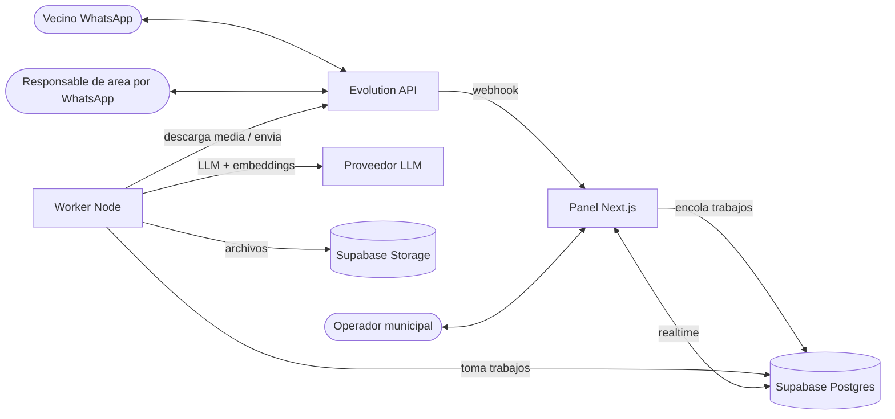

# Arquitectura — Mesa de Entrada Digital Epuyén

> Estado: diseño inicial (2026-09-30). Documento vivo: se actualiza al cerrar cada fase.
> Relacionados: [data-model.md](data-model.md) · [flows.md](flows.md) · [reuse-from-seguros.md](reuse-from-seguros.md)

## 1. Visión general

El sistema tiene cuatro piezas:

1. **Evolution API** (autoalojado): mantiene la sesión de WhatsApp de cada línea municipal y avisa por webhook cada mensaje.
2. **Panel web** (Next.js): lo usan los operadores. Expone el webhook, las pantallas y las acciones del servidor.
3. **Worker** (Node): procesa en segundo plano lo que es lento o puede fallar — descargar adjuntos, transcribir audios, correr el bot LLM, notificar a contactos externos.
4. **Supabase**: Postgres (datos, RLS, funciones atómicas, pg_cron, pgvector), Auth, Realtime y Storage.



## 2. Principios

- **El webhook solo persiste y encola.** Nunca llama al LLM ni descarga archivos: responde 200 rápido para que Evolution no reintente ni se trabe. Todo lo demás es un trabajo en `jobs`.
- **La base de datos es la fuente de verdad de los estados.** Tomar, delegar, aceptar, rechazar, resolver y cerrar tareas son funciones SQL atómicas (estado esperado + `FOR UPDATE` + historial en la misma transacción). La interfaz nunca escribe estados "a mano".
- **Historial append-only.** Eventos de conversación, historial de tareas y registro de actividad solo admiten insert.
- **El bot es un operador más, con reglas.** Sus respuestas pasan por el mismo guard de envío, quedan como mensajes `bot` y cada decisión se registra en `bot_runs`.
- **Nada queda sin dueño.** Toda conversación tiene un área; si no tiene operador dueño, está en la cola de esa área.
- **Privacidad por diseño.** Datos personales solo visibles por rol/área, enmascarados en logs, adjuntos en bucket privado con URLs firmadas de vida corta.

## 3. Componentes

### 3.1 Evolution API
- Imagen `evoapicloud/evolution-api` v2.x + Postgres + Redis (compose portado del CRM).
- Una **instancia por línea** de WhatsApp (ej. `mesa-entrada`; más adelante una por área si hace falta).
- Webhook configurado con eventos `MESSAGES_UPSERT`, `MESSAGES_UPDATE` (estados) y `CONNECTION_UPDATE`, con header de secreto.
- Expuesto al panel por URL privada o túnel (Cloudflare Tunnel en el instalador on-prem del CRM).

### 3.2 Panel web (Next.js 15, App Router)
- **Webhook** `POST /api/webhooks/evolution`: valida secreto (obligatorio), normaliza el payload, guarda mensaje/conversación de forma idempotente y encola trabajos.
- **Pantallas**: cola de mensajería, conversación + ficha del poblador, tareas, notas, pobladores, base de conocimiento, configuración (áreas, operadores, líneas, envío seguro, horarios, bot), soporte (errores), métricas.
- **Server Actions** para todas las mutaciones; llaman a funciones SQL o a servicios de dominio.
- **Realtime**: suscripción a `conversations`, `messages`, `tasks` filtrada por organización; aplica cambios parciales (no recarga todo como el CRM).

### 3.3 Worker
Proceso Node separado (mismo repo, carpeta `worker/`) que consume la tabla `jobs` con `FOR UPDATE SKIP LOCKED`.

| Tipo de trabajo | Qué hace |
|---|---|
| `media.download` | Baja el adjunto desde Evolution, lo guarda en Storage, completa el mensaje |
| `media.transcribe` | Transcribe audios (speech-to-text) y guarda la transcripción |
| `media.read` | OCR / visión sobre imágenes y PDFs; deja resumen como nota |
| `bot.reply` | Decide si el bot responde, deriva o calla (ver flows.md) y ejecuta |
| `outbound.send` | Envío saliente con reintentos y guard de envío |
| `external.notify` | Notifica tareas a contactos externos y procesa sus respuestas |
| `knowledge.index` | Trocea y genera embeddings de documentos de la base de conocimiento |

Reintentos con backoff; al agotar intentos, el trabajo queda `failed` y se registra en `error_logs`.

### 3.4 Supabase
- **Postgres 15+** con RLS en todas las tablas, extensiones `pg_trgm` (búsqueda), `vector` (RAG), `pg_cron` (abandono de tareas, SLA, purgas).
- **Auth** email + contraseña; perfiles en `profiles`.
- **Storage** buckets privados: `whatsapp-media`, `task-files`, `knowledge-docs`; `avatars` público.
- **Realtime** sobre `conversations`, `messages`, `tasks`, `conversation_events`.

### 3.5 Proveedor LLM (a definir en Phase 6)
Se accede por una interfaz propia (`contracts/llm.ts`) para poder cambiar de proveedor: `chat`, `embed`, `transcribe`, `vision`. Criterios de elección: calidad en español rioplatense, costo por conversación, latencia, política de datos.

## 4. Estructura del repositorio (propuesta)

Monorepo npm workspaces. Dentro de cada app se respeta la separación **presentation / features-services / infrastructure / contracts**.

```text
/
├── apps/
│   └── web/                         # Panel Next.js
│       └── src/
│           ├── app/                 # Rutas (App Router) y API routes
│           ├── presentation/        # Componentes UI por feature (inbox, citizens, tasks, notes, settings…)
│           ├── features/            # Servicios de dominio y server actions por feature
│           ├── infrastructure/      # Supabase clients, Evolution client, storage, crypto
│           ├── contracts/           # Tipos, esquemas Zod, DTOs compartidos
│           └── i18n/                # Textos es-AR
├── worker/                          # Consumidor de jobs (Node)
│   └── src/{jobs,features,infrastructure,contracts}
├── packages/
│   └── shared/                      # Lógica pura compartida web/worker (teléfonos, SLA, estados, prompts)
├── supabase/
│   ├── migrations/
│   ├── tests/                       # Tests de RLS y funciones SQL
│   └── seed.sql
├── infra/
│   ├── evolution/                   # docker-compose + .env.example de Evolution
│   └── runbooks/
├── docs/                            # Este directorio
└── .planning/                       # GSD: proyecto, requisitos, roadmap, estado
```

## 5. Seguridad

- **Webhook**: secreto obligatorio por línea (comparación en tiempo constante); sin secreto configurado → 503, nunca "dejar pasar".
- **Secretos** (API key de Evolution, secreto de webhook) cifrados AES-256-GCM con `CREDENTIALS_ENCRYPTION_KEY` dedicada (sin fallback a la service role key, a diferencia del CRM).
- **RLS por organización y área**: helpers `current_org_id()`, `current_role()`, `current_area_ids()`.
- **Service role** solo en webhook, worker y funciones privilegiadas (sellado de auditoría).
- **Modo de envío** `allowlist` por defecto en entornos nuevos.
- **Logs** con redacción de DNI, CUIT, teléfono, email y tokens.

## 6. Entornos

| Entorno | Panel | Evolution | Supabase | Envío |
|---|---|---|---|---|
| Local | `next dev` | Docker local | Supabase local (CLI) | `dry_run` |
| Staging | Hosting a definir | VPS/servidor municipal, número de prueba | Proyecto staging | `allowlist` |
| Producción | Hosting a definir | Servidor municipal/VPS, número oficial | Proyecto prod | `production` |

## 7. Decisiones abiertas

| Tema | Opciones | Se decide en |
|---|---|---|
| Hosting del panel | Vercel · VPS con Docker | Phase 1 (mínimo) / Phase 7 |
| Hosting de Evolution | Servidor municipal on-prem (instalador del CRM) · VPS | Phase 2 |
| Proveedor LLM / embeddings / STT | A comparar | Phase 6 |
| Worker: proceso propio vs. funciones programadas | Proceso Node persistente (recomendado) | Phase 2 |
