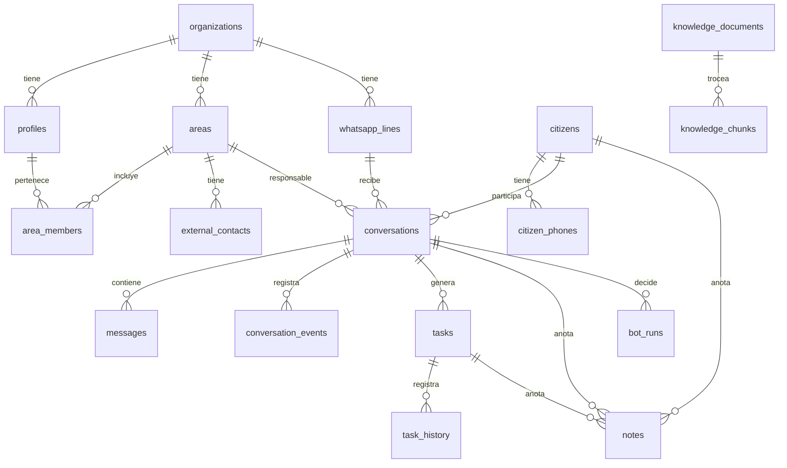

# Modelo de datos — Mesa de Entrada Digital Epuyén

> Estado: diseño inicial (2026-09-30), actualizado 2026-10-05 con lo implementado en `foundation-workspace-auth` (migración `supabase/migrations/20260930000100_foundation.sql`). Nombres técnicos en inglés; comentarios en español.
> Convenciones: toda tabla de negocio tiene `id uuid pk`, `org_id uuid not null`, `created_at`, `updated_at` (trigger). RLS habilitado en todas.
> Marcas: **[implementado]** existe en la base; **[pendiente]** columna diseñada que todavía no se creó; el resto es diseño.

## 1. Mapa general

## 2. Organización, equipo y áreas

### `organizations` [implementado]
`name`, `slug unique`, `created_at`. Seed: `epuyen`.
- `timezone` (default `America/Argentina/Buenos_Aires`) **[pendiente]**: hoy la zona horaria está fija en la UI (`Intl` con `America/Argentina/Buenos_Aires`) y en los filtros de soporte (UTC-3). Se agrega cuando se necesite el horario hábil (SLA, fase 3).

### `profiles` [implementado]
`id = auth.users.id` (on delete cascade), `org_id`, `full_name` (2–80 caracteres), `role user_role default 'operator'`, `avatar_path`, `is_active bool default true`, `created_at`, `updated_at` (trigger `set_updated_at`). Índice `org_id`.
- `email` **[pendiente]**: el email vive en `auth.users`; el cambio `areas-operators-admin` decide si se replica para listar operadores.
- `deactivated_at` **[pendiente]**: llega con la desactivación desde la UI (`areas-operators-admin`).
- Trigger `profiles_guard_privileged_columns`: solo un admin puede cambiar `role`, `org_id` o `is_active` (si no, error `P0001 forbidden_column`).
- Altas y bajas solo con service role (seed o futura pantalla de admin).

### Bucket `avatars` (Storage) [implementado]
Público para lectura, máximo 2 MB, JPEG/PNG/WebP. Ruta `{org_id}/{user_id}/{uuid}.{ext}`; un usuario solo puede subir, reemplazar o borrar en su propia carpeta.

### `areas`
`name`, `description`, `color`, `is_active`, `is_default bool` (una sola por org: "Mesa de Entrada"), `sla_warning_minutes`, `sla_critical_minutes`.

### `area_members`
`area_id`, `user_id`, `is_lead bool`. PK `(area_id, user_id)`.

### `external_contacts`
Responsables que reciben tareas por WhatsApp sin usar el panel.
`area_id`, `full_name`, `phone_normalized`, `is_active`. Único `(org_id, phone_normalized)`.

### `org_settings`
`org_id pk`, `send_mode send_mode default 'allowlist'`, `allowlist_phones text[]`, `bot_paused bool default false`, `business_hours jsonb` (por día: rangos hh:mm), `holidays date[]`, `task_abandon_days int default 7`, `privacy_notice text`, `out_of_hours_message text`.

## 3. Canal WhatsApp

### `whatsapp_lines`
`name`, `display_phone`, `evolution_base_url`, `evolution_instance unique`, `default_area_id`, `status line_status`, `last_status_at`.

### `whatsapp_line_secrets`
`line_id pk`, `api_key_ciphertext`, `webhook_secret_ciphertext`. **RLS sin políticas** (solo service role).

### `quick_replies`
`area_id null` (null = todas), `shortcut`, `title`, `body`, `is_active`.

## 4. Pobladores

### `citizens`
| Columna | Notas |
|---|---|
| `registration_status citizen_registration` | `unregistered` / `registered` |
| `party_kind party_kind` | `person` / `organization` |
| `full_name`, `dni`, `email` | `dni` único parcial por org cuando no es null |
| `address_line`, `neighborhood` | barrio o paraje |
| `whatsapp_push_name`, `whatsapp_avatar_url`, `whatsapp_avatar_fetched_at` | capturados del canal |
| `tags text[]`, `observations text` | |
| `field_sources jsonb` | `{ "full_name": "manual", "dni": "bot", ... }` — `manual` no se pisa |
| `registered_at`, `registered_by` | |
| `merged_into_id uuid null` | si se unificó con otro poblador |
| `last_contact_at` | |

Índices trigram sobre `full_name`, `dni`.

### `citizen_phones`
`citizen_id`, `phone_normalized`, `is_primary`, `source`. **Único `(org_id, phone_normalized)`** → un teléfono pertenece a un solo poblador. Permite varios números por vecino (unificación de duplicados).

## 5. Conversaciones y mensajes

### `conversations`
Una por `(org_id, line_id, phone_normalized)`.

| Columna | Notas |
|---|---|
| `line_id`, `citizen_id`, `phone_normalized` | |
| `area_id not null` | área responsable (default: área de la línea) |
| `bot_state bot_state` | `active` / `handoff` / `paused` |
| `queue_column queue_column` | ver enum |
| `owner_user_id null` | dueño humano |
| `delegated_from_user_id`, `pending_area_id`, `awaiting_acceptance bool` | delegación pendiente (a usuario o a área) |
| `entered_queue_at` | cuándo entró a la cola (base del FIFO) |
| `resolved_at`, `resolved_by` | |
| `last_message_at`, `last_inbound_at`, `last_outbound_at` | |
| `needs_response bool` | último mensaje es del vecino y no fue respondido |
| `sla_due_at` | calculado con horario hábil del área |
| `topic`, `urgency` | sugeridos por el bot |

Índice para la cola: `(org_id, area_id, owner_user_id nulls first, entered_queue_at)` donde `queue_column <> 'resolved'`.

### `messages`
| Columna | Notas |
|---|---|
| `conversation_id`, `direction message_direction`, `sender_kind sender_kind` | |
| `author_user_id null` | operador que escribió |
| `content_type content_type`, `body` | texto o texto al pie |
| `media_path`, `media_mime`, `media_size`, `media_status media_status` | adjunto en Storage |
| `transcription`, `media_summary` | audio transcripto / resumen de documento |
| `location jsonb` | lat, lng, nombre |
| `external_id`, `delivery_status delivery_status` | único `(line_id, external_id)` |
| `quoted_external_id` | respuesta citada |
| `metadata jsonb` | |

### `conversation_events` (append-only)
`conversation_id`, `event_type conversation_event_type`, `actor_kind actor_kind`, `actor_user_id`, `from_column`, `to_column`, `from_area_id`, `to_area_id`, `note`, `metadata jsonb`.

### `conversation_reads`
`conversation_id`, `user_id`, `last_read_at`, `last_read_message_id`. PK `(conversation_id, user_id)`.

## 6. Tareas y notas

### `tasks`
| Columna | Notas |
|---|---|
| `conversation_id null`, `citizen_id null` | origen |
| `title`, `body`, `kind task_kind`, `priority smallint 1..4` | 1 = urgente |
| `status task_status`, `outcome task_outcome null` | outcome obligatorio al cerrar |
| `audience task_audience` | `self` / `area` / `user` / `external` |
| `area_id`, `assigned_user_id`, `external_contact_id` | según audiencia |
| `awaiting_acceptance bool`, `delegated_from_user_id` | |
| `due_at`, `started_at`, `completed_at`, `completed_by`, `cancelled_at` | |
| `cancel_reason_code cancel_reason`, `cancel_reason_text` | texto obligatorio si `other` |
| `last_activity_at` | base para abandono automático |
| `public_ref` | número corto legible (ej. `T-0123`) para WhatsApp externo |
| `notify_citizen_on_close bool` | |

### `task_history` (append-only)
`task_id`, `event task_event`, `actor_kind`, `actor_user_id`, `external_contact_id`, `from_status`, `to_status`, `from_assignee`, `to_assignee`, `elapsed_ms`, `details jsonb`.

### `task_files`
`task_id`, `storage_path`, `file_name`, `mime`, `size`, `uploaded_by`.

### `notes`
`body`, `kind note_kind`, `author_user_id null` (null = sistema/bot), `conversation_id`, `citizen_id`, `task_id`, `parent_note_id` (respuestas de un nivel), campos de sello: `correlation_id`, `sealed_at`, `content_hash`, `seal_method`. Trigger: nota sellada inmutable y no borrable.

### `note_reads`
`note_id`, `user_id`, `read_at`.

### `entity_mentions`
`source_type (note|task)`, `source_id`, `entity_type (citizen|conversation|task|user|area)`, `entity_id`, `label_snapshot`. Sincronización atómica por función SQL.

## 7. Bot y conocimiento

### `knowledge_documents`
`title`, `source_kind (pdf|text|faq|url)`, `storage_path`, `area_id null`, `is_active`, `valid_until null`, `indexed_at`, `index_status`.

### `knowledge_chunks`
`document_id`, `chunk_index`, `content`, `embedding vector(N)`, `metadata jsonb` (página, sección). Índice HNSW.

### `bot_runs`
`conversation_id`, `trigger_message_id`, `decision bot_decision`, `answer`, `sources jsonb` (chunks citados), `confidence numeric`, `handoff_reason handoff_reason null`, `suggested_area_id`, `topic`, `urgency`, `extracted_fields jsonb`, `model`, `latency_ms`, `tokens_in`, `tokens_out`.

## 8. Operación

### `jobs`
`type job_type`, `status job_status`, `payload jsonb`, `attempts`, `max_attempts`, `run_after`, `locked_at`, `locked_by`, `last_error`. Consumo con `FOR UPDATE SKIP LOCKED`.

### `activity_log` (append-only)
`actor_user_id`, `action activity_action`, `citizen_id`, `conversation_id`, `task_id`, `details jsonb`.

### `error_logs` [implementado]
`org_id null` (null = error sin operador identificado, p. ej. antes del login), `source (web|api|worker|db)`, `level error_level`, `status error_status default 'open'`, `trace_id`, `message`, `details jsonb` (redactado; incluye `digestRef` para unir el reporte del navegador con el del servidor), `user_id null`, `resolved_by`, `resolved_at`, `created_at`. Índices `(org_id, status, created_at desc)` y `trace_id`.
- Los errores del futuro webhook de Evolution se registran con `source = 'api'` (es un route handler); no hay valor `webhook`.
- Inserción solo con service role (la app usa el cliente admin en el servidor).
- Trigger `error_logs_guard_update`: solo se puede cambiar `status`; al pasar a `resolved` sella `resolved_by = auth.uid()` y `resolved_at = now()`, y los limpia al reabrir.
- Purga automática a 30 días: función `purge_error_logs()` (solo service role) programada con `pg_cron` todos los días 06:00 UTC.

## 9. Enums

| Enum | Valores |
|---|---|
| `user_role` [implementado] | `admin`, `area_lead`, `operator`, `support` |
| `error_level` [implementado] | `error`, `warn`, `info` |
| `error_status` [implementado] | `open`, `acknowledged`, `resolved` |
| `line_status` | `connected`, `disconnected`, `error` |
| `send_mode` | `dry_run`, `allowlist`, `production` |
| `citizen_registration` | `unregistered`, `registered` |
| `party_kind` | `person`, `organization` |
| `bot_state` | `active`, `handoff`, `paused` |
| `queue_column` | `new`, `claimed`, `in_progress`, `waiting_external`, `resolved` |
| `message_direction` | `inbound`, `outbound` |
| `sender_kind` | `citizen`, `bot`, `operator`, `phone` (escrito desde el teléfono), `system` |
| `content_type` | `text`, `image`, `audio`, `video`, `document`, `location`, `sticker`, `contact`, `unsupported` |
| `media_status` | `none`, `pending`, `stored`, `failed` |
| `delivery_status` | `pending`, `sent`, `delivered`, `read`, `failed`, `blocked` |
| `conversation_event_type` | `QUEUED`, `CLAIMED`, `MOVED`, `DELEGATED`, `ACCEPTED`, `REJECTED`, `RESOLVED`, `REOPENED`, `BOT_PAUSED`, `BOT_RESUMED`, `AREA_CHANGED` |
| `actor_kind` | `operator`, `bot`, `system`, `external` |
| `task_kind` | `inquiry`, `complaint`, `procedure`, `documentation`, `referral`, `other` |
| `task_status` | `pending`, `in_progress`, `done`, `cancelled`, `failed` |
| `task_outcome` | `resolved`, `abandoned`, `referred_outside`, `citizen_unresponsive`, `duplicate` |
| `task_audience` | `self`, `area`, `user`, `external` |
| `cancel_reason` | `citizen_unresponsive`, `duplicate`, `not_municipal`, `resolved_other_channel`, `wrong_area`, `other` |
| `task_event` | `CREATED`, `CLAIMED`, `DELEGATED`, `ACCEPTED`, `REJECTED`, `STATUS_CHANGED`, `DUE_CHANGED`, `NOTE_ADDED`, `COMPLETED`, `CANCELLED`, `FAILED`, `REOPENED`, `ABANDONED`, `EXTERNAL_NOTIFIED`, `EXTERNAL_REPLIED`, `BOT_CREATED` |
| `note_kind` | `observation`, `status_update`, `system`, `audit`, `bot_summary` |
| `bot_decision` | `answered`, `asked_clarification`, `handoff`, `silent` |
| `handoff_reason` | `low_confidence`, `sensitive_topic`, `citizen_requested`, `out_of_hours`, `media_needs_review`, `error` |
| `job_type` | `media.download`, `media.transcribe`, `media.read`, `bot.reply`, `outbound.send`, `external.notify`, `knowledge.index` |
| `job_status` | `queued`, `running`, `done`, `failed` |

## 10. Reglas de acceso (RLS)

| Recurso | admin | area_lead | operator | support |
|---|---|---|---|---|
| Conversaciones / mensajes | todas | de sus áreas | de sus áreas + propias + delegadas a él | lectura |
| Pobladores | todos | todos (lectura/edición) | todos (lectura/edición) | lectura |
| Tareas | todas | de sus áreas | de sus áreas + asignadas a él | lectura |
| Notas | todas | según entidad | según entidad | lectura |
| Áreas, operadores, líneas, settings | escritura | lectura (y miembros de su área) | lectura | lectura |
| Historial / eventos / activity_log | solo insert por funciones; lectura según entidad | | | |
| Secretos | nadie (service role) | | | |
| error_logs | lectura + cambiar estado (su org) | — | — | lectura + cambiar estado (su org y filas con `org_id` null) |

**Implementado hoy (nivel organización):** las funciones `current_org_id()` y `current_user_role()` (`security definer`, `stable`, `search_path = ''`) devuelven null si el perfil no existe o está inactivo, así que un usuario desactivado no coincide con ninguna política. `organizations`: lectura de la propia org. `profiles`: lectura de la propia org; actualización de la fila propia o, para admin, de cualquier fila de su org. `anon` no tiene permisos. El filtro por área (`current_area_ids()`) llega en `areas-operators-admin`.

## 11. Funciones SQL (transiciones atómicas)

Todas `security invoker` (salvo sellado), filtran por `current_org_id()`, toman `FOR UPDATE`, validan estado esperado y escriben su evento en la misma transacción.

- Conversaciones: `claim_conversation`, `delegate_conversation(target_user | target_area, note)`, `accept_conversation_delegation`, `reject_conversation_delegation(note)`, `ensure_owner_for_reply`, `move_conversation(column)`, `resolve_conversation`, `reopen_conversation` (usada por el webhook), `set_conversation_area`.
- Tareas: `create_task`, `claim_task`, `delegate_task`, `accept_task`, `reject_task`, `start_task`, `complete_task(outcome)`, `cancel_task(reason, text)`, `reopen_task`, `abandon_stale_tasks()` (pg_cron).
- Pobladores: `register_citizen`, `merge_citizens(keep, drop)`, `upsert_citizen_field(field, value, source)` (respeta `manual`).
- Auditoría: `seal_audit_note(correlation_id, ...)` (security definer, solo service role).
