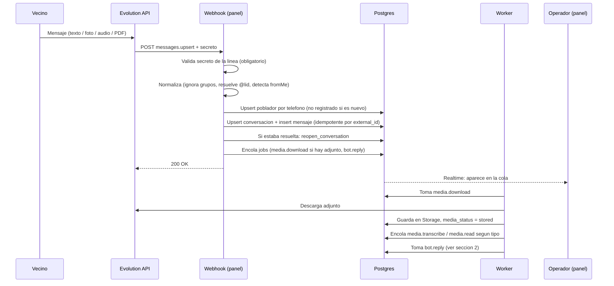
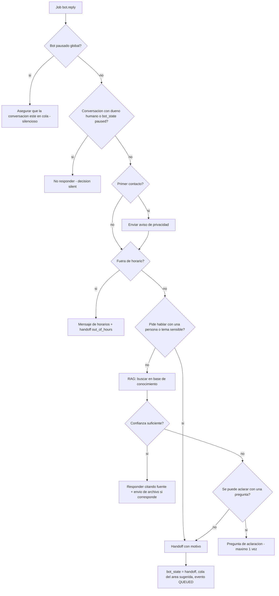
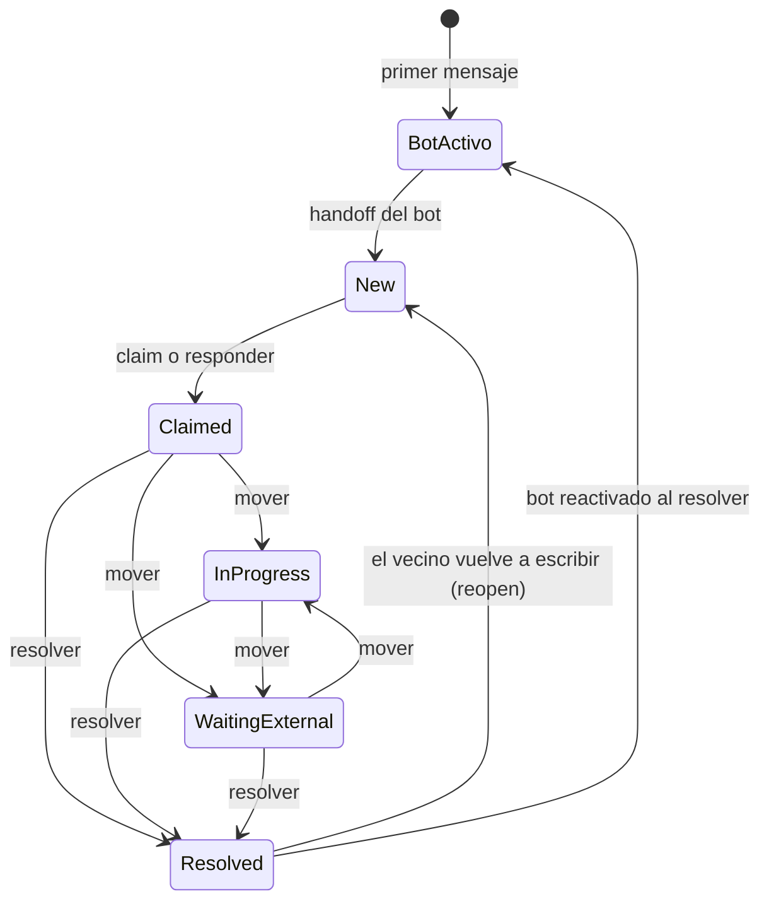
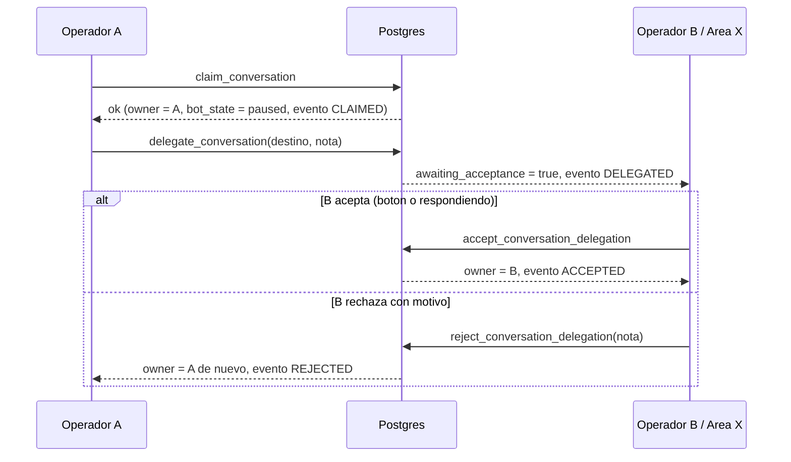
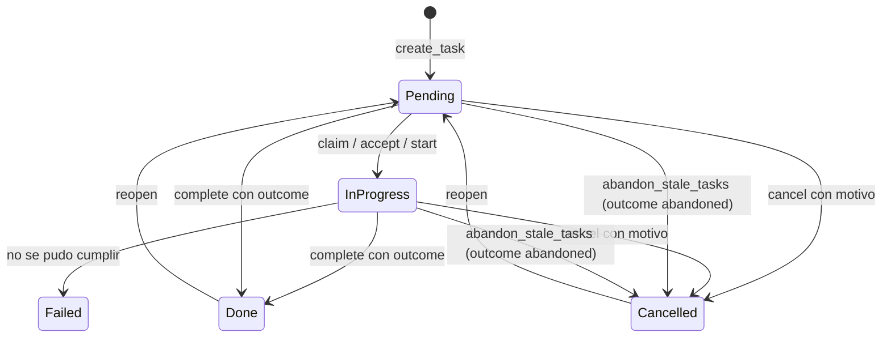
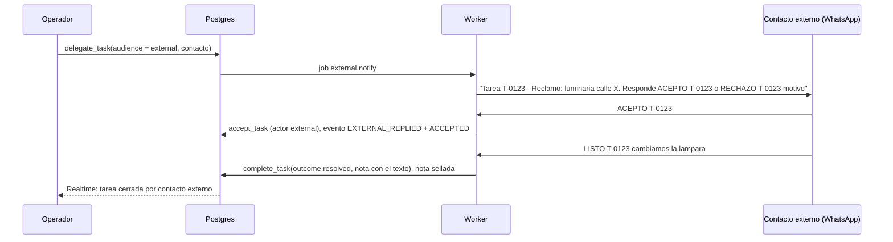

# Flujos — Mesa de Entrada Digital Epuyén

> Estado: diseño inicial (2026-09-30). Nombres de tablas y enums según [data-model.md](data-model.md).

## 1. Mensaje entrante (de punta a punta)

Reglas:
- `fromMe` (escrito desde el teléfono de la línea) se guarda como saliente con `sender_kind = phone`; no dispara bot.
- `messages.update` actualiza `delivery_status` (entregado / leído).
- El poblador nuevo se crea con `registration_status = unregistered`, `whatsapp_push_name` y teléfono en `citizen_phones`.
- `needs_response = true` y `last_inbound_at = now()` en cada mensaje del vecino.

## 2. Decisión del bot

Siempre, en paralelo a la respuesta:
- **Clasificación**: `topic`, `urgency`, `suggested_area_id` en `bot_runs` y en la conversación.
- **Extracción de datos**: si detecta nombre/DNI/domicilio, pregunta "¿Confirmás que tu DNI es 12.345.678?" y recién con el "sí" llama a `upsert_citizen_field(..., source = 'bot')`.
- **Registro**: toda decisión queda en `bot_runs` (fuentes, confianza, motivo) y es visible para el operador.

Handoff: el acuse al vecino ("Tu consulta fue derivada a [Área]. Te responde una persona a la brevedad.") se envía **una sola vez** por episodio de cola, no en cada mensaje (bug del CRM).

## 3. Estados de la conversación

Dos ejes independientes: **columna de la cola** (`queue_column`) y **estado del bot** (`bot_state`).

Reglas de `bot_state`:
- `active` → el bot atiende.
- `handoff` → pasó a cola; el bot calla.
- `paused` → hay dueño humano; el bot calla. Se pone al hacer claim y vuelve a `active` al resolver.
- Al reabrir (vecino escribe sobre resuelta): si el bot está activo globalmente, `bot_state = active` y el bot decide; si deriva, vuelve a `new`.

Orden de la cola (INB-01): primero sin dueño por `entered_queue_at` ascendente (FIFO), luego con dueño por `last_inbound_at` descendente. Dentro de cada grupo, `needs_response` y SLA crítico suben.

## 4. Claim y delegación con aceptación (soft handoff)

Detalles:
- **Delegar a usuario**: `owner_user_id = destino`, `delegated_from_user_id = A`, `awaiting_acceptance = true`. Mientras espera, A sigue viendo la conversación.
- **Delegar a área**: `pending_area_id = X`, `owner_user_id = null`, `awaiting_acceptance = true`; aparece en la cola del área X como "delegada, esperando que alguien la tome". Quien la toma primero la acepta (claim = accept). Si un `area_lead` de X la rechaza, vuelve a A.
- **Responder = tomar/aceptar** (`ensure_owner_for_reply`): sin dueño → claim; delegación pendiente propia → accept; dueño otro → bloquea con "Esta conversación la tiene [nombre]".
- Conflictos de concurrencia: `FOR UPDATE` + estado esperado → error `CLAIM_CONFLICT` legible.

## 5. Ciclo de vida de una tarea

- **Audiencias**: `self` (queda en curso para mí), `area` (bolsa del área; cualquiera la toma), `user` (delegada con aceptación), `external` (contacto externo por WhatsApp, sección 6).
- **Cierre**: `complete_task(outcome)` exige `outcome` y guarda `completed_by`. "Quién la resolvió" = `completed_by` (o `external_contact_id` si cerró un externo).
- **Abandono automático**: pg_cron diario ejecuta `abandon_stale_tasks()` → tareas abiertas con `last_activity_at` más viejo que `task_abandon_days` pasan a `cancelled` con `outcome = abandoned`, evento `ABANDONED`, actor `system`, nota sellada.
- **Aviso al vecino**: si `notify_citizen_on_close`, al cerrar con `resolved` se encola un mensaje al vecino por la conversación de origen.
- Toda transición escribe `task_history` y actualiza `last_activity_at` en la misma transacción.

## 6. Delegación a un contacto externo por WhatsApp

Para responsables de área que no usan el panel (ej. encargado de un corralón o delegado de un paraje).

Reglas:
- Los mensajes del contacto externo llegan por la misma línea; el webhook detecta que el teléfono es un `external_contact` y los enruta al protocolo de tareas (no crean conversación de vecino ni disparan el bot).
- Comandos reconocidos (insensibles a mayúsculas/acentos): `ACEPTO <ref>`, `RECHAZO <ref> <motivo>`, `LISTO <ref> <detalle>`, `NO SE PUEDE <ref> <motivo>` (→ `failed`). Si el mensaje no coincide, se responde con la ayuda de comandos.
- Recordatorio automático si no hay respuesta en X horas; al vencer, vuelve a la bolsa del área con evento en el historial.

## 7. Registro progresivo del poblador

1. **Primer contacto**: `unregistered`, teléfono + pushName + foto.
2. **Durante la charla**: el bot pide datos solo cuando hacen falta para el trámite consultado (no un formulario de entrada). Datos confirmados → `source = bot`.
3. **Operador**: completa o corrige desde la ficha lateral del chat → `source = manual` (tiene prioridad).
4. **Registrado**: con nombre + DNI + teléfono, el operador (o el bot, con confirmación) llama a `register_citizen`; la tarjeta de la cola cambia de flag.
5. **Crecimiento**: domicilio, barrio/paraje, email, etiquetas se suman con el uso. La ficha muestra "datos faltantes".
6. **Duplicados**: `merge_citizens(keep, drop)` mueve teléfonos, conversaciones, tareas y notas al que se conserva y marca `merged_into_id`.

## 8. Envío saliente (cualquier origen)

1. Normalizar teléfono a `549…`.
2. Guard de envío (`send_mode`): `dry_run` nunca envía; `allowlist` solo a la lista; bloqueos quedan como `delivery_status = blocked` + `activity_log`.
3. Si es operador: `ensure_owner_for_reply` antes de enviar.
4. Enviar por Evolution (`sendText` / `sendMedia` con `mediatype` correcto: image, document, audio).
5. Guardar mensaje con `external_id`; los estados posteriores llegan por `messages.update`.
6. Actualizar `last_outbound_at`, `needs_response = false`.
